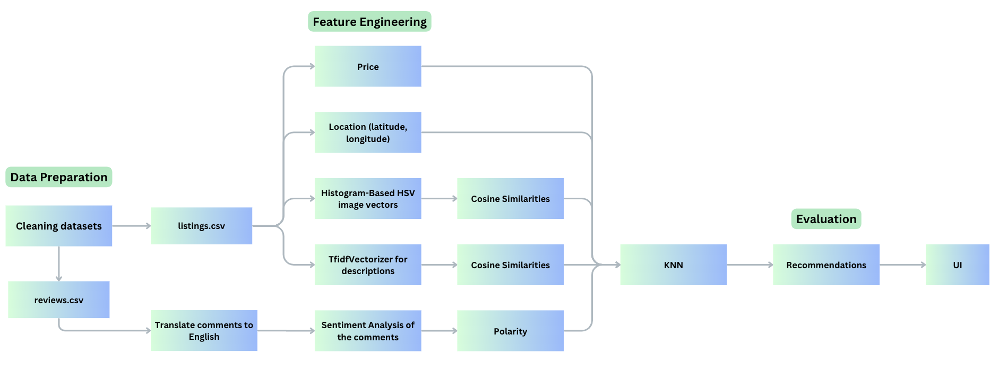

# New York Airbnb Accommodation Recommender  

This project provides a recommendation system for New York Airbnb accommodations using combined features such as text descriptions, images, price, and location data.  

The dataset used for this project was collected from [Inside Airbnb](https://insideairbnb.com/get-the-data/).  

---

## 📥 **Dataset**  

The full prepared dataset can be accessed using this [link](https://drive.google.com/file/d/1XB4J599--eWhnTLb07Tssy2Gvibwn1zZ/view?usp=drive_link).  

---

## 🚀 **How to Use**  

Before running the application, ensure the KNN model and combined features are saved. You can generate these by running the notebook:  

```
save_compute_similarities.ipynb
```

To launch the Streamlit app, execute the following command:

```
streamlit run airbnb_knn.py
```

## 🛠️ **Implementation Pipeline**

The project implementation follows the pipeline below:



### 🎯 Project Goals

- Build a robust recommender system combining multiple features (price, description, images, location).
- Utilize advanced text analysis (TF-IDF, Sentiment Analysis).
- Compute similarity between listings using Cosine Similarity and KNN.

### Key Methods
1. TF-IDF (Term-Frequency, Inverse Document Frequency Vectorizer)
   - Quantifies the importance of a term in a document relative to its frequency and rarity across multiple documents.
     - Term Frequency (TF): Relative frequency of a term in a document.
     - Inverse Document Frequency (IDF): Measures how rare a term is across all documents.
2. Sentiment Analysis
   - Sentiment analysis is performed using VADER (Valence Aware Dictionary and sEntiment Reasoner).
   - Reference: Hutto, C.J. & Gilbert, E.E. (2014). VADER: A Parsimonious Rule-based Model for Sentiment Analysis of Social Media Text.
   - VADER generates a Compound Score: a normalized sum of lexicon ratings ranging from -1 (most negative) to +1 (most positive).
3. Image Features
   - Image Histograms (HSV): Histograms of Hue, Saturation, and Value capture the pixel value distribution in images.
   - Similarity: Image similarity is computed by comparing HSV histograms.
4. Cosine Similarity
   - Cosine similarity is calculated between textual descriptions and image HSV vectors to measure feature similarity.
5. K-Nearest Neighbors (KNN)
   - Recommendations are generated using the KNN algorithm with:
     - ```k = 10```
     - Combined features: price, location, image similarity, description similarity, and polarity.
